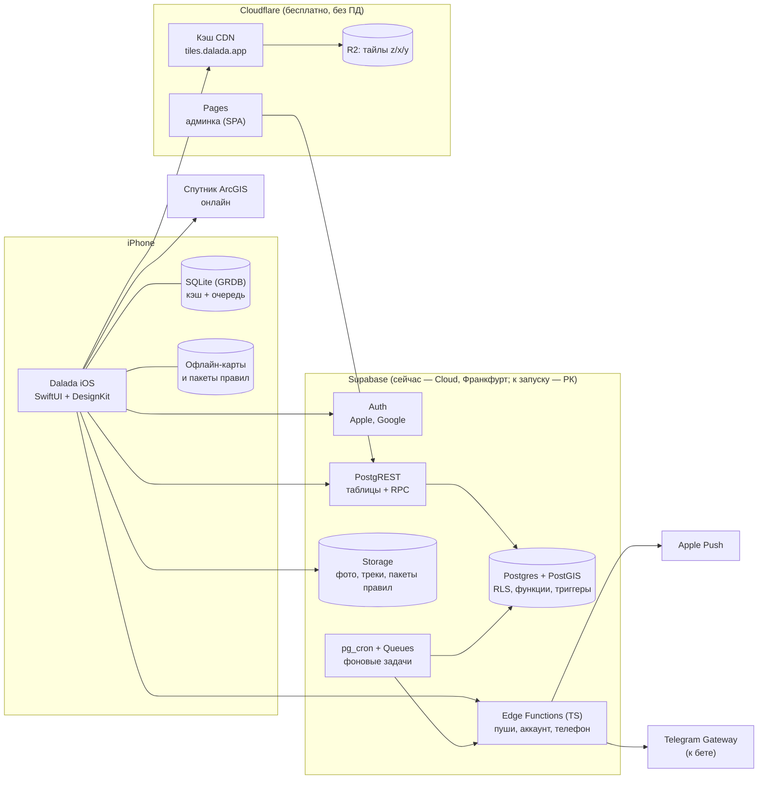

# 03. Архитектура и стек

> Этап 3 из 5. Обновлено: 2026-09-29 — переход на **Supabase** и бесплатный старт.
> Основа — [план продукта](../02-plan/README.md) и [принятые решения](../00-product-brief.md#принятые-решения).
> Статусы: **принято** — решение владельца продукта; **предложено** — моя рекомендация, можно менять.

| Документ | О чём |
|----------|-------|
| [01-ios-app.md](01-ios-app.md) | iOS-приложение: модули, экраны, локальная БД и офлайн, запись трека, карта, вход, локализация, тесты |
| [02-backend.md](02-backend.md) | Бэкенд на Supabase: схема и RLS, приватность в базе, RPC-функции, Edge Functions, фоновые задачи, медиа, админка |
| [03-maps-geo.md](03-maps-geo.md) | Карты и геоданные: MapLibre, свои тайлы на Cloudflare R2, офлайн-пакеты, спутник, правила на карте, навигация |
| [04-infra.md](04-infra.md) | Инфраструктура: Supabase Cloud → РК, лимиты бесплатных планов, CI/CD, бэкапы, переезд в Казахстан |

## Что определяет архитектуру

1. **Один разработчик (+ Claude) и нулевой бюджет.** Готовая платформа вместо своего сервера:
   Supabase закрывает базу, вход, файлы, API и фоновые задачи. Всё — на бесплатных планах.
2. **Персональные данные — в Казахстане к публичному запуску.** Разработка и закрытая бета — в
   Supabase Cloud (Франкфурт); перед публичным запуском — переезд на self-hosted Supabase в РК.
   Supabase — open source, поэтому переезд меняет в приложении только адрес и ключ.
3. **Офлайн в поле.** Локальная БД на устройстве — источник правды для экранов; всё созданное без
   сети уходит из очереди, когда сеть появится.
4. **Приватность мест — внутри базы.** Чужие данные читаются только через функции, которые
   применяют видимость и огрубляют координаты. Прямого доступа к чужим строкам нет.
5. **Android позже.** Supabase-клиенты есть для всех платформ; логика — в базе и Edge Functions,
   а не в iOS-приложении.

## Схема системы



## Ключевые решения

| # | Область | Решение | Статус |
|---|---------|---------|--------|
| D1 | Бэкенд | **Supabase**: Postgres + PostGIS, Auth, Storage, PostgREST (API из схемы), Edge Functions, pg_cron, Queues, Realtime | Принято |
| D2 | Язык серверной логики | **TypeScript** (Edge Functions, админка) + SQL (RLS, функции, триггеры) | Принято |
| D3 | База данных | Postgres (Supabase) + PostGIS + pg_trgm + unaccent | Принято |
| D4 | Контракт API | Схема БД + RPC-функции = API; миграции в репозитории — источник правды; типы генерируются для TS и Swift | Предложено |
| D5 | Вход | **Apple и Google** при регистрации; **телефон — позже**, в момент ценности; подтверждение через Telegram Gateway включаем к бете | Принято |
| D6 | Карта на iOS | **MapLibre Native** + свои тайлы из OpenStreetMap (бесплатно) | Принято |
| D7 | Спутник | ArcGIS World Imagery — бесплатно до 2 млн тайлов в месяц, только онлайн | Предложено |
| D8 | Локальная БД на iOS | GRDB (SQLite) + очередь операций (outbox) | Предложено |
| D9 | Архитектура iOS | SwiftUI, `@Observable` MVVM, SPM-модули по фичам, Swift 6, supabase-swift | Предложено |
| D10 | Хостинг | **Сейчас:** Supabase Cloud Free (Франкфурт) + Cloudflare Free — $0. **К публичному запуску:** self-hosted Supabase в РК | Предложено |
| D11 | Админка | React + Refine с провайдером данных Supabase; статический хостинг Cloudflare Pages | Предложено |
| D12 | Ошибки и аналитика | Xcode Organizer + MetricKit; метрики продукта — SQL-функции по данным в базе, без событий ([M17](../04-beta/M17-metrics.md)); анонимные события (TelemetryDeck или таблица в Supabase) — только по решению владельца: политика обещает «без аналитики поведения» | Метрики сделаны, события — предложено |
| D13 | CI/CD | GitHub Actions: миграции и тесты БД (Supabase CLI, pgTAP), Edge Functions, админка, тайлы; Xcode Cloud: iOS → TestFlight | Предложено |
| D14 | Роутинг (1.1) | Valhalla — нужен сервер, решим к 1.1 | Отложено |

## Этапы хостинга

| Этап | Когда | Где | Стоимость |
|------|-------|-----|-----------|
| **A. Разработка** | Сейчас → закрытая бета | Supabase CLI локально (Docker) + Supabase Cloud Free, 2 проекта: `dalada-dev`, `dalada-beta` | $0 |
| **B. Закрытая бета** | Март – апрель 2027 | `dalada-beta` на Free; при упоре в лимиты — Pro ($25 в месяц) | $0–25 |
| **C. Публичный запуск** | ~20 мая 2027 | Self-hosted Supabase на VM в РК + S3 в РК (или Cloud, если юрист подтвердит, что можно) | ~40–80 тыс. ₸ в месяц |

Бета-тестеры дают явное согласие на хранение данных за пределами РК. Подробно — в [04-infra.md](04-infra.md).

## Структура репозитория (монорепо)

```
dalada/
├── ios/
│   ├── project.yml            XcodeGen, как в DesignKit Gallery
│   ├── Dalada/                таргет приложения: сборка зависимостей, навигация
│   ├── DaladaWidgets/         Live Activity
│   └── Packages/              локальные SPM-модули (Core, фичи, UI)
├── supabase/
│   ├── config.toml            конфигурация Supabase CLI
│   ├── migrations/            SQL-миграции: таблицы, RLS, функции, триггеры
│   ├── functions/             Edge Functions (TypeScript)
│   ├── tests/                 тесты БД (pgTAP): матрица видимости и др.
│   └── seed.sql               тестовые данные для локальной разработки
├── admin/                     админка (React + Refine)
├── geo/                       сборка тайлов, выгрузка в R2, стили карты, импорт OSM и DEM
├── web/                       страницы для шаринга (1.1)
└── docs/
```

## Технические спайки перед разработкой

| # | Спайк | Критерий успеха |
|---|-------|-----------------|
| S1 | MapLibre + свои тайлы на R2 за кэшем Cloudflare; офлайн-пакет «Капшагай и Иле»; казахские подписи; условия ArcGIS для спутника | Пакет < 150 МБ, скачивается < 3 мин по 4G, карта плавная на iPhone двухлетней давности |
| S2 | Запись трека 8 часов в фоне; выгрузка приложения системой; Live Activity | ≤ 25% батареи за 8 ч в «Экономном» режиме; трек не теряется |
| S3 | Supabase: вход Apple и Google через supabase-swift; RPC «места в области» с видимостью и огрублением; фоновая загрузка фото по подписанной ссылке | Чужие точные координаты недоступны никаким запросом (тест pgTAP); вход < 5 с |
| S4 | Репетиция переезда (до публичного запуска): восстановление проекта из Cloud в self-hosted Supabase | Данные и пользователи перенесены; приложение работает после смены адреса |

## Затраты

| Статья | Сейчас | К публичному запуску |
|--------|--------|----------------------|
| Supabase | $0 (Free) | Self-hosted в РК: VM + S3 ~40–80 тыс. ₸ в месяц; или Cloud Pro от $25 |
| Cloudflare (R2, Pages) | $0 (бесплатные лимиты) | $0–5 |
| Спутник (ArcGIS) | $0 (до 2 млн тайлов в месяц) | $0, дальше $0,15 за 1 000 тайлов |
| Подтверждение телефона (Telegram Gateway) | $0 (выключено) | ~$5–10 на бету, $0,01 за код |
| Apple Developer Program | $99 в год | $99 в год |
| Домен `dalada.app` | ~$15–20 в год | ~$15–20 в год |

## Что осталось решить

Блокирующих вопросов нет — можно переходить к Этапу 4 (спецификации). Уточнить по ходу:

- Юрист: можно ли закрытую бету хранить в Supabase Cloud с согласием тестеров и нужен ли переезд в РК
  до публичного запуска (моя рекомендация — да, переезжать).
- Условия ArcGIS для спутниковых тайлов в нативном мобильном приложении с MapLibre (проверим в спайке S1).
