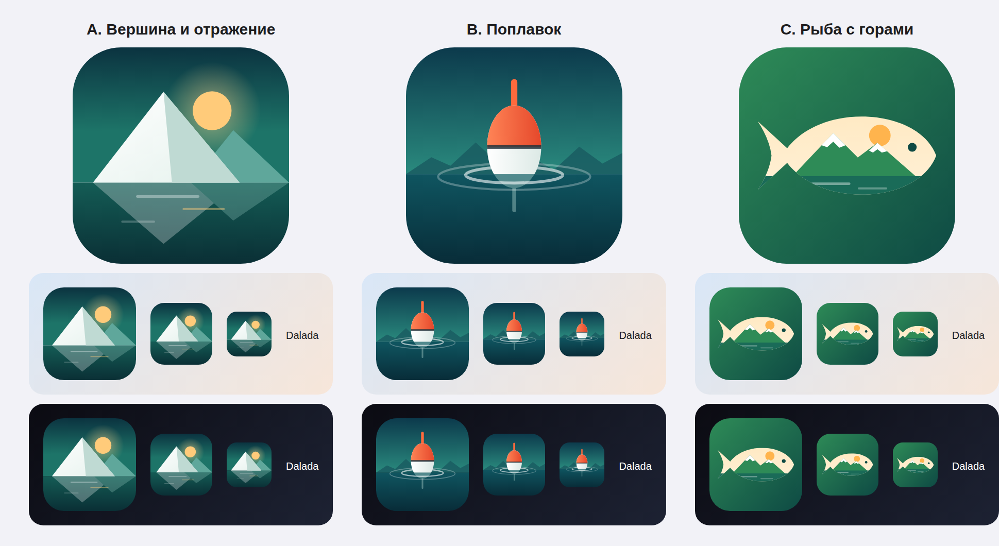

# 05. Релиз 1.0 в App Store

> 2026-10-09. Статус: **решения владельца приняты** (раздел «Решения»), идёт R1.
> Цель — **выйти в App Store, как только готово**, не дожидаясь открытия сезона, и набирать
> пользователей органически. Витрина — только Казахстан, поэтому карта — на весь Казахстан.

## Где мы сейчас

| Что | Состояние |
|-----|-----------|
| Функции | Всё из MVP и почти всё из 1.1 — в бете: вехи [M1–M33](../04-beta/README.md), сборка 138 у внутренних и внешних тестировщиков, интерфейс на DesignKit 3 |
| Нет из MVP | Друзья из контактов, своя админка (модерация сейчас в Supabase Studio) |
| Нет из 1.1 | Планировщик маршрутов по дорогам и тропам, видео |
| Карта | Своя подложка, рельеф и «Карты без сети» — только Алматинская область, Жетісу и Алматы; места, запреты, нацпарки — тоже. **Нужна вся страна** |
| Сервер | Supabase Cloud Free во Франкфурте. Бэкапы — workflow готов, ждёт настройки владельца ([04-infra](../03-architecture/04-infra.md#бэкапы)) |
| Языки | RU / KK / EN; строки интерфейса на казахском вычитаны (2026-10-06, PR #4). Не вычитаны: 18 статей, тексты пушей, страницы сайта, 3 строки разрешений (`InfoPlist.xcstrings`) |
| Ошибки | Отзывы о сбоях из TestFlight; отчёты MetricKit — с ближайшей сборки (R1) |
| Витрина | Иконка временная (из M0), страницы в App Store и скриншотов нет, версия 0.1.0 |
| Контент | 286 мест редакции, 19 статей, правила и запреты 2026 года — всё по Алматинской области и Жетісу |

## Этапы

| # | Что | Готово, когда |
|---|-----|---------------|
| R1 | **Витрина и надёжность**: бэкапы, иконка (B — поплавок), тексты страницы App Store, скриншоты, анкеты App Store Connect, MetricKit | Страница App Store заполнена (кроме сборки 1.0), бэкап проверяется восстановлением |
| R2 | **Карта Казахстана**: подложка, рельеф в горах и «Карты без сети» по областям; места из OpenStreetMap, нацпарки и заповедники по всей стране; запреты на лов — где есть данные; тексты «Алматинская область» → «Казахстан» | Карта, места и слои открываются в любой области |
| R3 | **Отправка 1.0**: версия 1.0.0, заметки для проверки, отправка, ручной выпуск | Приложение в App Store Казахстана |
| R4 | **После выхода**: органический рост, ежедневно — краши, отзывы, жалобы, метрики; исправления 1.0.x | Падений < 0,5 % сессий, жалобы разобраны за 24 ч |
| — | **Дальше**: друзья из контактов, админка, фоновая отправка, «Итоги года», вычитка казахских статей, переезд в РК, 1.1 (планировщик маршрутов, видео) | — |

### R1. Витрина и надёжность

- [ ] **Бэкапы** — workflow **Backup** готов (2026-10-09): каждую ночь дамп базы, проверка
  восстановлением в чистую базу, шифрование age, закрытый бакет R2; фото — раз в неделю.
  **От владельца** — 6 шагов настройки в [04-infra](../03-architecture/04-infra.md#настройка-владелец-один-раз):
  бакет, доступ к нему, ключ age, строка подключения, ключи S3 к Storage, пробный запуск.
- [x] **Иконка B (поплавок)** — раздел [«Иконка»](#иконка): слои для Liquid Glass, сборка 139
  вместе с правками DesignKit 3.1–3.2.
- [x] **Тексты страницы App Store** RU / EN — раздел [«Страница App Store»](#страница-app-store):
  `appstore/listing/`, отправка из `main` через App Store Connect API.
- [ ] **Скриншоты** — раздел [«Скриншоты»](#скриншоты): workflow **Screenshots** готов (UI-тест, рамки
  с подписями); первый прогон, выбор кадров, загрузка в App Store Connect.
- [x] **MetricKit**: отчёты о сбоях и зависаниях — в закрытую таблицу `private.diagnostics` без
  привязки к человеку (не больше 20 в день на аккаунт, храним 90 дней), политика дополнена; в ярлыке
  приватности — «Диагностика, не связана с вами». Смотреть: Supabase Studio →
  `select kind, signature, app_version, count(*) from private.diagnostics group by 1, 2, 3 order by 4 desc`.
- [ ] **Анкеты App Store Connect** — раздел [«Анкеты»](#анкеты-app-store-connect).
- [ ] **Проверки названия** из [naming.md](../naming.md): поиск в App Store Казахстана, товарный знак
  в НИИС (классы 9 и 42), `@dalada` в Instagram, Telegram, TikTok.

### R2. Карта Казахстана

- [ ] **Подложка** на всю страну: `bounds` Казахстана в `map/config.json`, тайлы 0–14 (Planetiler).
- [ ] **Рельеф и горизонтали** — по горным районам (Алтай, Тарбагатай, Джунгарский и Заилийский
  Алатау, Каратау, Улытау), а не по всей степи: высоты всей страны не помещаются на диск сборщика,
  а в степи горизонтали не нужны.
- [ ] **«Карты без сети»** по областям (17 областей + города республиканского значения).
- [ ] **Места** из OpenStreetMap по всей стране: водоёмы, стоянки, родники, платники, базы.
- [ ] **Нацпарки, заповедники, погранзона** по всей стране (OpenStreetMap).
- [ ] **Запреты на лов**: нерестовые запреты по областям из приказа (где удастся собрать); где данных
  нет — честная подпись «Правила для этой области ещё не внесены».
- [ ] **Тексты**: описание в App Store, онбординг, сайт — «Казахстан» вместо «Алматинская область и
  Жетісу».

### R3. Отправка 1.0

- [ ] **Версия 1.0.0**: смена `MARKETING_VERSION` снова отправляет сборку на бета-проверку Apple
  (сутки-двое).
- [ ] **Заметки для проверки** — обновить под 1.0 ([review_notes.txt](../../appstore/testflight/review_notes.txt)).
- [ ] **Отправка** 1.0 и **ручной выпуск** после одобрения.
- [ ] **Сайт**: кнопка App Store и Smart App Banner (`apple-itunes-app`) на страницах.

### R4. После выхода

- [ ] Каждый день: краши (Organizer, MetricKit), отзывы в App Store (ответ на каждый), жалобы (24 ч),
  метрики [M17](../04-beta/M17-metrics.md): North Star, воронка новых, W1.
- [ ] Исправления 1.0.x — с поэтапным выпуском (7 дней), чтобы ошибка не ушла сразу всем.
- [ ] Органический рост: рыболовные Telegram-чаты, Instagram, ссылки «Поделиться» и приглашения в
  поездки; событие в App Store (In-App Event) к открытию сезона в мае.

## Решения

Приняты владельцем 2026-10-09:

| # | Вопрос | Решение |
|---|--------|---------|
| 1 | Когда запускаемся | **Как только всё готово**, не ждём мая; пользователей набираем органически |
| 2 | Страны | **Только Казахстан** — и карта на весь Казахстан (R2). ЕС — не раньше, чем будет статус трейдера по DSA |
| 3 | Домен | **Пока без домена**: сайт и ссылки остаются на `dkicekeeper.github.io/Dalada`, почта поддержки — текущая |
| 4 | Аккаунт разработчика | **Личный** (уже есть): продавец на странице — имя владельца |
| 5 | Подтверждение телефона | **Отложено**: платная регистрация по номеру не нужна. Друзья из контактов — позже и без номера в аккаунте (см. ниже) |
| 8 | Иконка | **B — поплавок** |

Остаются открытыми:

| # | Вопрос | Варианты | Рекомендую |
|---|--------|----------|------------|
| 7 | Хранение данных в РК | Закон РК «О персональных данных и их защите» требует хранить базу с данными граждан в РК; с ранним запуском данные пользователей с первого дня во Франкфурте. Варианты — переезд на self-hosted Supabase в РК ([сравнение провайдеров](../03-architecture/04-infra.md#переезд-в-казахстан-перед-публичным-запуском), ~40–80 тыс. ₸ в месяц) до или вскоре после выхода | Консультация юриста; переезд — в первые месяцы после выхода |
| 9 | Фото для скриншотов | Свои / амбассадоров с письменным разрешением | Амбассадоров: настоящие уловы |
| 10 | Проверка казахского носителем | Знакомый носитель / переводчик | Носитель из целевой аудитории (рыбак) |

**Друзья из контактов без номера в аккаунте.** Если номер в профиле не подтверждён, любой может
вписать чужой номер и показаться друзьям того человека «знакомым из контактов» — так легко выманить
доступ к записям «для друзей». Поэтому без подтверждения номера — только безопасные варианты:
«Пригласить из контактов» (ссылка-приглашение в WhatsApp или SMS выбранному человеку) и поиск по
адресам e-mail из контактов, подтверждённым при входе через Google. Сопоставление по номерам — только
вместе с подтверждением номера, если к нему вернёмся.

## Иконка

Временная иконка (горы, солнце, волны) — общая, тонкие волны пропадают в маленьком размере, и
она не говорит «рыбалка». Новая должна:

- узнаваться в 40 px на домашнем экране — один крупный силуэт, без текста и мелких деталей;
- говорить «на природе» (далада) и «рыбалка», без привязки только к рыбалке;
- держать цвета приложения (акцент `#2E8B57`) и смотреться рядом со Strava, AllTrails, 2GIS;
- работать в iOS 26 в вариантах **по умолчанию, тёмном, тонированном и прозрачном** (Liquid Glass).

**Выбран B — поплавок** (2026-10-09). Концепты (исходники SVG — в [`icon/`](icon/)):

| | Идея | Плюсы | Минусы |
|-|------|-------|--------|
| **A. Вершина и отражение** | Снежный пик Алатау и его отражение в воде, рассвет | Спокойная, «премиальная», про природу в целом | Горы с солнцем — частый мотив у туристических приложений |
| **B. Поплавок** | Красно-белый поплавок на воде, круги, горы на горизонте | Сразу «рыбалка», самый заметный силуэт в 40 px, редкий мотив в App Store | Сильнее привязывает к рыбалке |
| **C. Рыба с горами** | Силуэт рыбы, внутри — горы, солнце и вода | Рыбалка и природа в одном знаке, запоминается | Детали внутри рыбы теряются в маленьком размере |

**Как сделано (2026-10-09):** файл Icon Composer `ios/Dalada/AppIcon.icon` — фон-градиент в
`icon.json` (отдельный, темнее — для тёмной темы) и четыре группы слоёв SVG в `Assets/`, спереди назад:
«поверхность» (передние половины кругов и вода поверх нижней части поплавка), «поплавок» — единственная
группа со стеклом Liquid Glass, задние половины кругов, «пейзаж» (горы на горизонте и вода).
Тонированный и прозрачный варианты iOS строит сама. PNG 1024 в `AppIcon.appiconset` — плоская
копия для страницы App Store и старых систем: `node docs/05-release/icon/render.mjs
ios/Dalada/AppIcon.icon <папка>` (там же превью на домашнем экране). Стекло подстроить руками — 10
минут в Icon Composer на Mac.

## Страница App Store

Основной язык — **русский**; второй — **английский (США)**. Казахского в App Store Connect нет
([список языков Apple](https://developer.apple.com/help/app-store-connect/reference/app-information/app-store-localizations/)),
а язык витрины Казахстана по умолчанию — английский (Великобритания). Поэтому английский (Великобритания)
не добавляем: тогда в Казахстане должна показываться страница на основном языке — русском. Проверим
на живой странице после выхода и, если нужно, поменяем. Казахские слова кладём в ключевые слова.

Тексты лежат в [`appstore/listing/`](../../appstore/listing/) — `<локаль>/name.txt` (30 символов),
`subtitle.txt` (30), `keywords.txt` (100), `promotional_text.txt` (170, меняется без проверки),
`description.txt` (4000) для `ru` и `en-US`, общие ссылки — `support_url.txt`, `marketing_url.txt`,
`privacy_policy_url.txt`. Категории: основная — «Спорт», дополнительная — «Путешествия».

Workflow **App Store page** (`appstore/listing.py`): на любой ветке проверяет длины, из `main` сам
отправляет тексты в App Store Connect (версию 1.0 создаёт, если её нет). Сборку к версии не
привязывает и на проверку не отправляет. Описание написано под выход с картой всего Казахстана.

## Скриншоты

**Формат:** iPhone 6,9″ — 1320 × 2868, вертикально (меньшие размеры App Store делает сам; iPad не
нужен — приложение только для iPhone). До 10 штук на язык; в поиске видны первые 3 — на них главное.
Языки: RU и EN.

**Сюжет** (подпись сверху крупно, под ней экран):

| # | Экран | Подпись RU | Подпись EN |
|---|-------|------------|------------|
| 1 | Карта: места с иконками, рельеф, Капшагай | Все места для рыбалки и отдыха — на одной карте | Every fishing and camping spot on one map |
| 2 | Карточка места: фото, свежие отчёты, погода, давление | Где клюёт сегодня: свежие отчёты и погода | What's biting today: fresh reports and weather |
| 3 | Своё место «Только я» с отчётом | Ваши места видите только вы | Your spots stay private |
| 4 | Отчёт с уловом и фото | Отмечайте уловы и рекорды | Log catches and personal bests |
| 5 | Запись поездки: трек, Live Activity | Запишите поездку: трек, время, расстояние | Record trips: track, time, distance |
| 6 | Запреты и нацпарки на карте | Запреты на лов и нацпарки — без штрафов | Fishing bans and national parks, no fines |
| 7 | Лента друзей, «Сейчас на выезде» | Друзья, лента и «где я» на выезде | Friends, feed and live location |
| 8 | Карта региона без сети | Карта работает без сети | Offline maps for the mountains and the water |
| 9 | Общие сборы и чеклисты | Соберитесь вместе и ничего не забудьте | Pack together, forget nothing |

**Как сделано (2026-10-09):** workflow **Screenshots** (вручную: Actions → Screenshots → Run workflow):
1. Симулятор iPhone 6,9″ (Pro Max), время 9:41, полная батарея, точка у Капшагая, разрешение на
   геопозицию.
2. UI-тест `ios/DaladaScreenshots` по-русски и по-английски: приложение само входит демо-аккаунтом
   (только в отладочной сборке, данные — из секретов `ASC_DEMO_*`), тест переключает вкладки, открывает
   место редакции по ссылке и снимает экраны: карта, место, «Места», профиль, поездка, «Лайфхаки»,
   «Главная». Не нашёлся экран — пропускает и снимает остальные.
3. Рамки и подписи — `appstore/screenshots/frame.py` (Pillow, шрифт Inter из DesignKit), подписи — в
   `appstore/screenshots/captions.json`. Где на экране фото мест редакции (Wikimedia Commons, CC BY /
   CC BY-SA) — подпись автора внизу рамки.
4. Результат — артефакт «screenshots»: `framed/<язык>/` (1320 × 2868) и `raw/`. Выбираем лучшие и
   загружаем в App Store Connect (позже — скриптом через API).

Дальше: витринные аккаунты с друзьями и лентой (сейчас — демо-аккаунт), видео-превью 15–30 с, A/B-тест
первых скриншотов (Product Page Optimization).

## Анкеты App Store Connect

| Анкета | Ответ |
|--------|-------|
| Приватность (App Privacy) | Собираем, связано с человеком, для работы приложения, **без отслеживания**: контактные данные (e-mail от входа через Apple или Google), точное местоположение (места, отчёты, треки), пользовательский контент (фото, тексты), идентификатор пользователя. **Не связано** с человеком: диагностика — сбои и производительность (MetricKit). Аналитики поведения нет ([M17](../04-beta/M17-metrics.md)) |
| Возрастной рейтинг | Есть пользовательский контент и общение (с жалобами, блокировкой и фильтром), нет насилия, азартных игр и т. п. Итог — по анкете Apple |
| Цена | Бесплатно, без встроенных покупок |
| Экспорт и шифрование | Только стандартное (`ITSAppUsesNonExemptEncryption = NO` уже в сборке) |
| Данные для проверки | Демо-аккаунт и [заметки для проверки](../../appstore/testflight/review_notes.txt) — есть, обновить под 1.0 |
| Авторские права | «2027 <владелец>» |

## Готовность к проверке Apple

| Требование | Статус |
|------------|--------|
| Жалобы, блокировка, фильтр, контакт (1.2) | ✅ с M6 |
| Удаление аккаунта в приложении (5.1.1(v)) | ✅ |
| Вход через Apple рядом с Google (4.8) | ✅ |
| Политика конфиденциальности и поддержка | ✅ |
| Фоновая геопозиция только для записи поездки, объяснение в заметках | ✅ |
| Разрешения с объяснением: уведомления — лист перед запросом (M9), геопозиция — системный запрос на карте с текстом зачем | ✅ |
| Атрибуция OpenStreetMap: кнопка ⓘ на карте (стиль тайлов), строка в карточках мест из OSM | ✅ |
| В тексте страницы — ни слова о других платформах (2.3.10) | При написании описания |
| Скриншоты показывают само приложение (2.3.3) | При съёмке |

## Риски

| Риск | Что делаем |
|------|------------|
| Отказ на проверке | Заметки для проверки подробные; демо-аккаунт с данными; исправляем и отправляем снова |
| Данные граждан РК хранятся во Франкфурте | Консультация юриста; переезд в РК в первые месяцы после выхода (решение 7) |
| Лимиты бесплатного Supabase (500 МБ база, 1 ГБ фото, 5 ГБ трафика) | Следим за ростом; Pro ($25/мес) или сервер в РК — до упора в лимит |
| Пусто в первые дни | Тестировщики и редакция заполняют «свежее» в главных местах; места из OpenStreetMap по всей стране |
| Ошибки в казахском | Интерфейс вычитан; статьи, пуши и сайт — после выхода; носитель языка смотрит живое приложение |
| Падение у всех после обновления | Поэтапный выпуск обновлений, MetricKit |

## Метрики запуска

По [плану продукта](../02-plan/README.md#метрики) и [M17](../04-beta/M17-metrics.md). Ориентиры на
первый месяц после выхода (уточним): 1 000 установок, 30 % новых делают первый отчёт или поездку за 7
дней, W4 ≥ 20 %, 40 % топ-20 мест со свежим отчётом каждую неделю.
